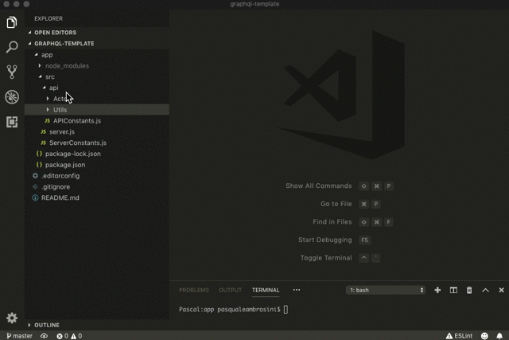

# GraphQL-NodeJS API Module Template
The aim of this template is to give to developers the guidelines for a new module/component API in a project based on our `GraphQL-NodeJS Project Template`.

## Install in Visual Studio Code

- Install [VZ Templates](https://marketplace.visualstudio.com/items?itemName=VisualZoran.vz-file-templates) in Visual Studio Code
- Edit VS Code `settings.json` adding:
    ```
    "vzfiletemplates.userTemplatesFolders": ["~/Documents/VSTemplates"]
    ```
-  Copy the `graphql-module` folder to the path defined in `settings.json`
-  Restart VSCode

## New Module

Create a folder in `app/src/api/YOUR_MODULE_NAME`, right click on it, `New File from Template`, select `GraphQL-NodeJS`, name your Module and click on `OK`.

A README isn't really a README without a GIF, so here it is:


## How it works
Each module is composed of multiple components, each component follows the single responsability principle, can be mocked or replaced at runtime.

### Module name: Actor
| FILE NAME | WHAT IT DOES |
| ------ | ------ |
| ActorConnector.js | Retrieves data from an external service, useful for External-API encapsulation |
| ActorDataProvider.js | Consumes data from the Connector and prepares data for GraphQL |
| ActorDataHandler.js | Handles data, save on a DB, create logs and any additional task |
| Actor.js | Consumes data from the DataHandler and exposes all the resolvers for GraphQL |
| Actor.graphql | Defines all the queries and mutations for GraphQL |
| MockActorConnector.js | Replaces the ActorConnector, defines mocked data simulating data response from an external service/API |
| MockActorDataHandler.js | Replaces the ActorDataHandler, executes any additional task on the received data |